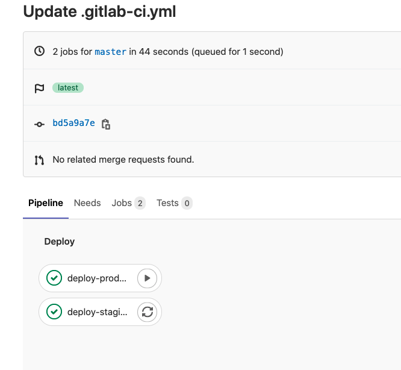
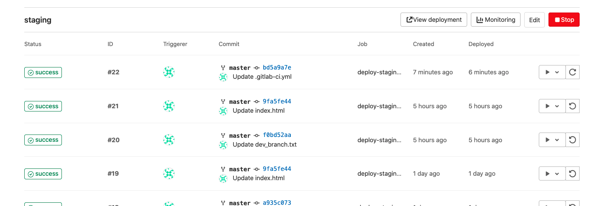
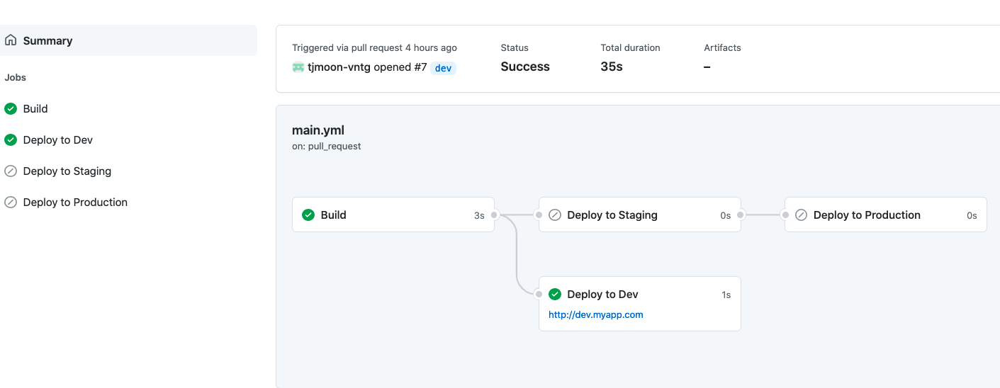
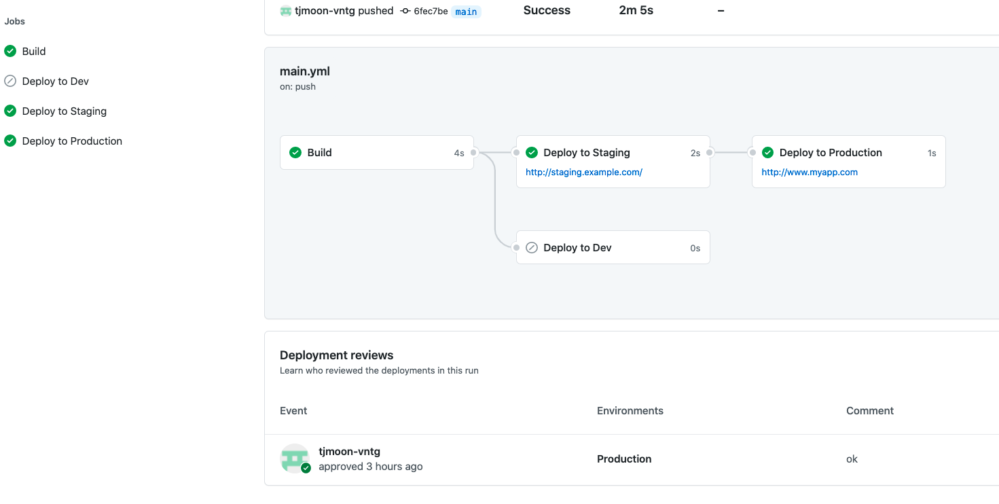
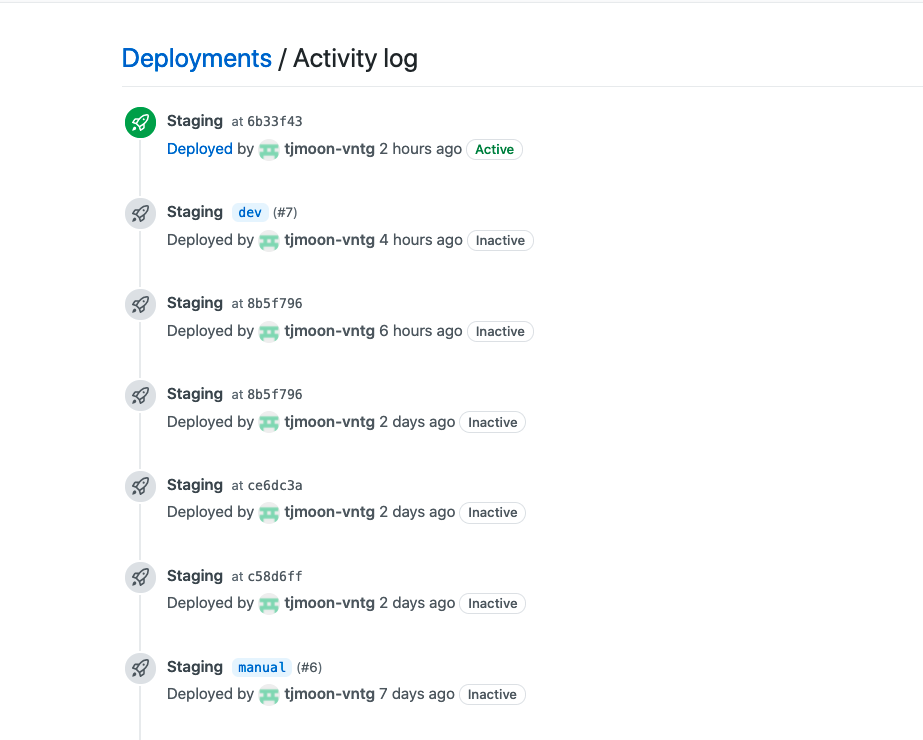

**<font size="6">소개:</font>**

이 문서는 github, gitlab의 CICD 기능을 테스팅하고 검토하면서 정리한 자료입니다.

* * *
<p>&nbsp;</p>

**<font size="6">선택 : 설치형 vs SaaS (Software as a Service)</font>**

- Gitlab은 모든 타입에서 설치형 지원
- Github는 Enterprise 에서만 설치형 지원

IDC나 사내에서 CICD 를 쓸 일이 있으면 필요한 곳에 runner 를 설치하면 가능
* * * 
<p>&nbsp;</p>

**<font size="6">Gitlab vs Github 가격비교</font>**


<!DOCTYPE html>
<html>
<head>
<style>
table {
  font-family: arial, sans-serif;
  border-collapse: collapse;
  width: 100%;
}
td, th {
  border: 2px solid #000000;
  
  text-align: left;
  padding: 8px;
}

</style>
</head>
<body>
<table>
  <tr>
    <th>Gitlab</th>
    <th>Github</th>
  </tr>
  <tr>
    <td>https://about.gitlab.com/pricing/</td>
    <td>https://github.com/pricing</td>
  </tr>
  <tr>
    <td>Free</td>
    <td>Free</td>
  </tr>
  <tr>
    <td>Premium : 1인당 월$19*12= 년 $228</td>
    <td>Team : 1인당 월 $4*12 = 년 $48</td>
  </tr>
  <tr>
    <td>Ultimate : 1인당 월$99*12=년 $1188</td>
    <td>Enterprise : 1인당 월 $21*12 = 년 $252</td>
  </tr>    
</table>

</body>
</html>

* * * 
<p>&nbsp;</p>

## Gitlab vs Github 기능 비교
#### 타입별 기능 비교:
Free 버전에서는 git 사용을 위한 기본적인 기능만 지원을 하며 기술지원 없음  
PR(MR) 요청을 했을 때 리뷰어를 두고 승인하는 기능은 Free 버전에는 없으며 Gitlab Premium이나 Github Team을 써야 함  
Gitlab Ultimate, Github Enterprise 는 주로 보안과 관련한 기능 추가

**일반적인 기능은 비슷하게 지원이 됨**
* 버전관리
* 프로젝트관리(wiki, issues)
* 패키지기능(npm, RubyGems, Apache Maven, Gradle, Docker, and NuGet, docker)
* CICD
* API 연동

**Gitlab은 CICD 기능 외에 다양한 부가 기능을 지원**
* <a href="https://docs.gitlab.com/ee/operations/" target="_top"><span style="color:blue">Monitor application 퍼포먼스 </span></a>
* 메트릭으로 신뢰성 및 안정성 측정
* 경고 및 사고 관리
* 애플리케이션의 오류 추적
* 애플리케이션 상태 및 성능 추적
* 로그 집계 및 저장
* 코드로 인프라 관리 (terraform remote backend)
* <a href="https://docs.gitlab.com/ee/user/project/clusters/" target="_top"><span style="color:blue">k8s 통합기능 </span></a> 
* 테스팅과 관련한 각종 툴이 통합 :  단위테스트 보고서, 접근성 테스트, 브라우저 성능 테스트, 코드 품질, 부하 성능 테스트, 메트릭 레포트 <a href="https://docs.gitlab.com/ee/ci/unit_test_reports.html" target="_top"><span style="color:blue">Unit 테스트 리포트 </span></a> 


**Gitlab에서는 여러 가지 부가기능을 많이 지원하지만 Github 에서는 다른 대체수단을 이용하여 처리할 수 있을 것으로 생각됨**
* terraform remote backend 는 AWS 에서 S3+dynamoDB 와 연동하여 처리 가능
* <a href="https://fluxcd.io/" target="_top"><span style="color:blue">k8s는 Flux </span></a> 나 <a href="https://argoproj.github.io/argo-cd/" target="_top"><span style="color:blue">Argo CD </span></a> 등을 이용
* CICD는 Github 에서 Github actions 를 지원하면서 큰 차이가 없음  
* Github marketplace 에서 필요한 것을 찾거나 직접 만들어서 사용 하면 됨

**Gitlab, Github CICD 예제**
* <a href="https://docs.gitlab.com/ee/ci/examples/README.html" target="_top"><span style="color:blue">Gitlab CI/CD 예제 </span></a>
* <a href="https://docs.github.com/en/actions/guides" target="_top"><span style="color:blue">Github 액션 가이드 </span></a>

**Gitlab CICD의 장점은 environments 를 이용하여 각 환경(staging, prod)에 대한 배포를 손쉽게 하고 기록을 확인가능한 점**  
* Github 은 environments<a href="https://docs.github.com/en/actions/reference/environments" target="_top"><span style="color:blue">environments </span></a> 기능을 public repo나 enterprise plan 일 경우에만 지원하고 github team 의 private repo에는 지원 안함  
* Github 에서 environments 기능은 리뷰어의 <a href="2020-12-15-github-actions-environments-environment-protection-rules-and-environment-secrets-beta/" target="_top"><span style="color:blue">승인 </span></a>이 있어야 배포 가능/트리거 발생후 일정 시간이 지나야 배포 가능/특정 브랜치만 배포 가능  


* * * 
<p>&nbsp;</p>

**<font size="8">Github 구성</font>**
* IDC에서 CICD를 하는 경우에는 IDC에 윈도우용 runner, LInux runner 구성  
* AWS 를 이용하는 경우에는 소스코드 관리는 Github로 하되 AWS CodePipeline 를 이용할 수도 있음. <a href="https://aws.amazon.com/ko/codepipeline/" target="_top"><span style="color:blue">소스코드링크</span></a>
 

**<font size="6">Github Actions</font>**

* Quickstart 에서 간단한 github actions  직접 만들어서 해봄. <a href="
 https://docs.github.com/en/actions/quickstart" target="_top"><span style="color:blue">액션링크</span></a>
* Guides 에서 주로 사용하는 언어를 골라서 build, test, deploy 하는 예제를 살펴본다. <a href="https://docs.github.com/en/actions/guides" target="_top"><span style="color:blue">액션가이드</span></a>
 

**<font size="6">Github Actions 배우기</font>**

* Learn GitHub Actions : github actions 를 이용하여 workflow 를 만드는 방법을 상세히 설명.  <a href="https://docs.github.com/en/actions/learn-github-actions" target="_top"><span style="color:blue">액션배우기</span></a>


* Github actions 과정에 대한 설명, actions 찾기, 조직과 워크플로우 공유하기, 보안 등을 다루고 있음. 

**<font size="6">Github Actions 만들기</font>**

Actions는 jobs을 만들고  workflow를 구성하는 개별 작업으로 자신이 직접 만들거나 github 커뮤니티에서 다른 사람들이 만든 것을 이용할 수 있다. <a href="https://docs.github.com/en/actions/creating-actions" target="_top"><span style="color:blue">자세히</span></a>


Actions는 3가지 타입으로 만들 수 있으며 Docker container, JavaScript, Composite run steps 가 있다.  <a href="https://docs.github.com/en/actions/creating-actions/about-actions" target="_top"><span style="color:blue">자세히</span></a>

Docker container 는 리눅스만 지원한다. JavaScript는 runner 에서 실행이 되며 “JavaScript 작업을 사용하면 작업 코드가 단순화되고 Docker 컨테이너 작업보다 빠르게 실행됩니다.” 라고 문서에 나와있다. Composite run steps 는 쉘스크립트를 이용하여 처리하는 경우로 Docker container, JavaScript  보다는 뒤에 기능이 추가가 되었다.

**<font size="6">Reference</font>**

Encrypted secrets : 암호화된 비밀정보.  workflow 파일에서  input 이나 environment 변수로 받아서 사용할 수 있음.<a href="https://docs.github.com/en/actions/reference/encrypted-secrets" target="_top"><span style="color:blue">자세히</span></a>


Environments 를 이용하면 배포시 몇가지 제한을 걸 수 있다. 리뷰어의 승인이 있어야 배포 가능, 트리거 발생후 일정 시간이 지나야 배포 가능, 특정 브랜치만 배포 가능. 그런데 이 기능은 공개 repo이거나 enterprise plan 일 경우에만 지원을 하고 github team 의 private repo에는 아직 지원 안함. <a href="https://docs.github.com/en/actions/reference/environments" target="_top"><span style="color:blue">자세히</span></a>


<a href="https://dev.to/n3wt0n/everything-you-need-to-know-about-github-actions-environments-9p7" target="_top"><span style="color:blue">Environments 를 이용한 예제</span></a> 

1. Pull Request 상태 일 때만 Dev에 배포
2. 메인에 커밋하거나 병합 할 때만 스테이징에 배포
3. 스테이징 후 승인을 받아 프로덕션에 배포

**<font size="6">Github Actions 제한</font>**
<a href="https://docs.github.com/en/actions/reference/usage-limits-billing-and-administration" target="_top"><span style="color:blue">자세히</span></a> 

Job execution time : 6시간
Workflow run time : 72 hours

#### Github self-hosted runners 
##### Github runner 설치 및 등록
Repository 또는 organization 차원에서 runner 를 등록할 수 있음. <a href="https://docs.github.com/en/actions/hosting-your-own-runners/adding-self-hosted-runners" target="_top"><span style="color:blue">자세히</span></a>


* runner 를 추가하는 화면에서 runner를 설치하고 설정하는 부분에 대한 설명이 나옴. 
* 설치시 root로 진행을 하면 sudo 관련한 에러가 나옴. 
* 보안을 위해서 별도 user를 만들어서 runner를 실행함. runner 를 실행할 user를 만들고 docker 를 사용하기 위해서 docker group에 추가를 해준다. 

```
useradd -m  -s /bin/bash --comment 'github runner'  github-runner
usermod -aG docker github-runner
sudo su - github-runner
```

```
deploy:
  type: git
  repo: https://github.com/VntgCorp/VntgCorp.github.io.git
  branch: master
  ```

##### Github-runner user로 runner 설치. 설정을 할 때  나오는 url과 token 정보를 이용:

```
$ mkdir actions-runner && cd actions-runner
$ curl -o actions-runner-linux-x64-2.278.0.tar.gz -L https://github.com/actions/runner/releases/download/v2.278.0/actions-runner-linux-x64-2.278.0.tar.gz
$ tar xzf ./actions-runner-linux-x64-2.278.0.tar.gz
.$ /config.sh --url https://github.com/VntgCorp --token ATZHRXXXXXXXX
```

##### 아래는 root 권한으로 실행을 해야 함. systemd 설정을 하며 실행하는 사용자를 지정하는 것임:

```
# ./svc.sh install github-runner
# ./svc.sh start
# ./svc.sh status
```

Self-hosted runners 를 github actions에 추가할 때 자동으로 self-hosted, 운영 체제 및 하드웨어 플랫폼 레이블이 설정 된다. 필요하면 추가 레이블을 설정할 수 있다. 예를 들어 x86_64 ubuntu 20.04 의 경우 self-hosted, linux, X64 로 나온다.

보안 문제로 public repo의 경우에는 기본적으로 organization에 있는 runner group 을 사용할 수 없다.<a href="https://docs.github.com/en/actions/hosting-your-own-runners/about-self-hosted-runners#self-hosted-runner-security-with-public-repositories" target="_top"><span style="color:blue">자세히</span></a>


workflow 에서 runner 사용: <a href="https://docs.github.com/en/actions/hosting-your-own-runners/using-self-hosted-runners-in-a-workflow" target="_top"><span style="color:blue">자세히</span></a>


runs-on: [self-hosted, linux, X64]. workflow에서 runner에 할당한 레이블을 넣으면 됨. (and 조건임)


 <a href="https://docs.microsoft.com/ko-kr/learn/paths/automate-workflow-github-actions/" target="_top"><span style="color:blue">Github actions 기타 참고자료</span></a>


#### Docker registry, container registry  
<a href="https://docs.github.com/en/packages/working-with-a-github-packages-registry/working-with-the-docker-registry" target="_top"><span style="color:blue">자세히</span></a>


```
$ docker login https://docker.pkg.github.com -u tjmoon-vntg
$ docker build -t docker.pkg.github.com/tjmoon-vntg/action_test/docker_test:1.0 .
$ docker push docker.pkg.github.com/tjmoon-vntg/action_test/docker_test:1.0
```
현재는 package namespace 를 사용하는 Docker registry 를 지원하고 있는데 향후에는 Container Registry 로 대체를 할 것이라고 함. Container Registry 는 사용자 또는 조직에 대해서 설정을 하며 아직은 베타버전임. <a href="https://docs.github.com/en/packages/working-with-a-github-packages-registry/enabling-improved-container-support-with-the-container-registry" target="_top"><span style="color:blue">자세히</span></a>


* * * 
<p>&nbsp;</p>

**<font size="8">Gitlab 구성</font>**

### Gitlab runner 설치 및 등록
Runner type : shared runners, group runners, specific runners

OS에 gitlab-runner 설치.
executor 가 여러 가지 있는데 docker 를 추천하고 있음. OS에 docker 설치.
gitlab-runner 설치 후 runner 를 등록함. 


<a href="https://docs.gitlab.com/runner/register/index.html#docker" target="_top"><span style="color:blue">executor docker</span></a>로 실행시 gitlab.example.com 을 찾지 못함. 

```
REGISTRATION_TOKEN=gCGg8tkK51TATVpjsBHz
sudo gitlab-runner register \
  --non-interactive \
  --url http://gitlab.example.com/ \
  --registration-token $REGISTRATION_TOKEN \
  --executor "docker" \
  --docker-image alpine:latest \
  --description "docker-runner" \
  --tag-list "docker,aws" \
  --run-untagged="true" \
  --locked="false" \
  --access-level="not_protected"

```


extra_hosts 옵션을 추가해서 docker 에서 /etc/hosts를 업데이트할 수 있음.
extra_hosts = ["other-host:127.0.0.1"] <a href="https://docs.gitlab.com/runner/configuration/advanced-configuration.html" target="_top"><span style="color:blue">자세히</span></a>
```
cat > /tmp/test-config.template.toml << EOF
[[runners]]
name = "docker-runner"
[runners.docker]
extra_hosts = ["gitlab.example.com:192.168.33.12"]
EOF


REGISTRATION_TOKEN=gCGg8tkK51TATVpjsBHz
sudo gitlab-runner register \
  --non-interactive \
  --url http://gitlab.example.com/ \
  --registration-token $REGISTRATION_TOKEN \
  --executor "docker" \
  --docker-image alpine:latest \
  --description "docker-runner" \
  --tag-list "docker,aws" \
  --run-untagged="true" \
  --locked="false" \
  --access-level="not_protected" \
  --template-config /tmp/test-config.template.toml   
```
shell로 등록시 아래 에러가 나왔음. gitlab-runner verify 명령으로 처리. 
'New runner. Has not connected yet.' <a href="https://gitlab.com/gitlab-org/gitlab-runner/-/issues/3750" target="_top"><span style="color:blue">에러</span></a>


### CICD <a href="https://docs.gitlab.com/ee/ci/pipelines/" target="_top"><span style="color:blue">pipeline</span></a>


* stage 는 정의를 하지 않으면 기본으로 5가지가 사용된다. (pre, build, test, deploy, post)
<a href="https://docs.gitlab.com/ee/ci/yaml/#stage" target="_top"><span style="color:blue">자세히</span></a>

* runner 에서 동시작업을 하려고 하면 gitlab-runner에서 concurrent 옵션을 바꾸어준다. 기본은 1로 되어 있다. 이 부분을 바꾸어 주어야 여러개의 job을 동시에 실행할 수 있다. <a href="https://docs.gitlab.com/runner/configuration/advanced-configuration.html#the-global-section" target="_top"><span style="color:blue">자세히</span></a>


* pipeline이 성공했을 때만 <a href="https://docs.gitlab.com/ee/user/project/merge_requests/merge_when_pipeline_succeeds.html" target="_top"><span style="color:blue">Merge</span></a>하는 기능은 유용할 듯.


* ssh 이용하는 경우 다음 내용 참고. <a href="https://docs.gitlab.com/ee/ci/examples/deployment/composer-npm-deploy.html" target="_top"><span style="color:blue">자세히</span></a> 

* environments 이용하여 배포 기록 남기고 과거 버전으로 롤백 할 수 있음.

#### 기타, 다른 툴과 연동
terraform 의 remote state 를 저장하는 용도로 사용 가능함. terraform을 여러 명이 함께 사용을 하는 경우 필요한 기능임. <a href="https://docs.gitlab.com/ee/user/infrastructure/index.html#gitlab-managed-terraform-state" target="_top"><span style="color:blue">자세히</span></a> 

https://docs.gitlab.com/ee/administration/terraform_state.html


## Github, Gitlab CICD environments 기능 비교

### gitlab environments 예제
environment 를 활용하는 간단한 예제이다. (.gitlab-ci.yml)
* 사전에 environment 에 staging, production 을 구성한다.
* 소스코드가 업데이트되면 ubuntu:20.04 docker 컨테이너에서 실행이 되며 staging 은 ssh를 이용하여 자동 배포가 된다.
* production 에는 수동으로 배포를 하도록 구성을 했다. (manual) 수동으로 배포를 할 수 있는 사람도 지정할 수 있다. <a href="https://docs.gitlab.com/ee/ci/yaml/#protecting-manual-jobs" target="_top"><span style="color:blue">자세히</span></a>    
* 이제 environment 로 가면 staging, production 환경별로 배포한 기록을 볼 수 있고 특정 commit 으로 롤백을 할 수도 있다.

```
image: ubuntu:20.04

before_script:
  - apt-get update
  - 'which ssh-agent || apt-get install openssh-client -y'
  - mkdir -p ~/.ssh
  - eval $(ssh-agent -s)
  - '[[ -f /.dockerenv ]] && echo -e "Host *\n\tStrictHostKeyChecking no\n\n" > ~/.ssh/config'

deploy-staging:
  stage: deploy
  script:
    - echo "staging, This job deploys something from the $CI_COMMIT_BRANCH branch."
    - ssh-add <(echo "$STAGING_PRIVATE_KEY")
    - ssh -p22 test@192.168.33.14 "mkdir -p test"
    - ssh -p22 test@192.168.33.14 "date ; touch a.txt"
    - scp -P22 * test@192.168.33.14:test/
    - scp -P22 index.html test@192.168.33.14:/var/www/html/index.html
  environment:
    name: staging
    url: http://staging.example.com

deploy-production:
  stage: deploy
  script:
    - echo "prd , This job deploys something from the $CI_COMMIT_BRANCH branch."
  environment:
    name: production
    url: http://www.example.com
  when: manual
  only:
    - master
```
<p>&nbsp;</p>

**<font size="3">Gitlab pipeline</font>**
<center></center>
<p>&nbsp;</p>

**<font size="3">Gitlab environments</font>**
<center></center>

<p>&nbsp;</p>

**<font size="3">Gitlab staging</font>**
<center></center>

<p>&nbsp;</p>

### github environments 예제
Github 은 environments 기능을 public repo나 enterprise plan 일 경우에만 지원하고 github team 의 private repo에는 지원 안함  
Github 에서 environments 기능은 리뷰어의 승인이 있어야 배포 가능/트리거 발생후 일정 시간이 지나야 배포 가능/특정 브랜치만 배포 가능  
https://docs.github.com/en/actions/reference/environments  

아래 github workflow 파일은 다음과 같은 내용을 담고 있다.
* 사전에 production environments 에 Required reviewers 설정을 함.
* Pull Request 상태 일 때만 Dev에 배포
* 메인에 커밋하거나 병합 할 때만 스테이징에 배포
* 스테이징 후 승인을 받아 프로덕션에 배포. 해당 environments 의 Required reviewers 가 승인을 해 주어야 배포가 됨.


```
# https://dev.to/n3wt0n/everything-you-need-to-know-about-github-actions-environments-9p7

name: CI + CD

on:
  push:
    branches: [ main ]
  pull_request:
    branches: [ main ]

  # Allows you to run this workflow manually from the Actions tab
  workflow_dispatch:

jobs:
  Build:
    runs-on: ubuntu-latest
    steps:
      - uses: actions/checkout@v2
      - name: Compile
        run: echo Hello, world!

  DeployDev:
    name: Deploy to Dev 
    if: github.event_name == 'pull_request'
    needs: [Build]
    runs-on: ubuntu-latest
    environment: 
      name: Development
      url: 'http://dev.example.com'
    steps:
      - name: Deploy
        run: echo I am deploying! 

  DeployStaging:
    name: Deploy to Staging 
    if: github.event.ref == 'refs/heads/main'
    needs: [Build]
    runs-on: ubuntu-latest
    environment: 
      name: Staging
      url: 'http://staging.example.com/'
    steps:
      - name: Deploy
        run: echo I am deploying! 

  DeployProd:
    name: Deploy to Production 
    needs: [DeployStaging]
    runs-on: ubuntu-latest
    environment: 
      name: Production
      url: 'http://www.example.com'
    steps:
      - name: Deploy
        run: echo I am deploying!             
 ```
<p>&nbsp;</p>

**<font size="3">Github dev</font>**
<center></center>

<p>&nbsp;</p>

**<font size="3">Github staging</font>**
<center></center>

<p>&nbsp;</p>

**<font size="3">Github staging-log</font>**
<center></center>