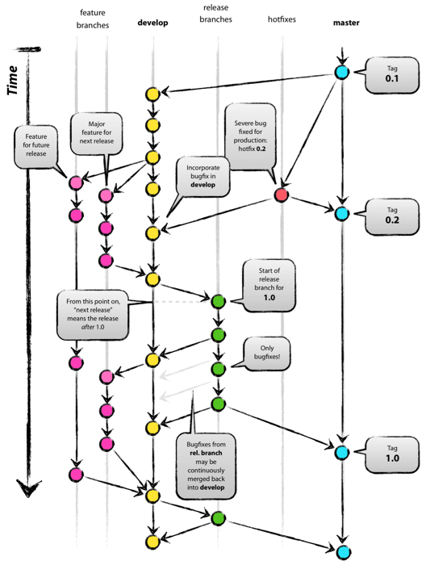

###### 찰리브라운@기술지원실

   
  

    
  

  

    <b>Git의 대표적인 3가지 workflow, Gitflow / Github flow / Gitlab flow</b>
   
   
   

개발언어(특히나 JavaScript관련)만큼 변화가 많은건 아니지만, Version Control System도 긴 역사끝에 현재는 Git의 전성기가 되었습니다.

  

    
  

  PVCS, SVN도 어느덧 추억의 이름이 되어가고...
   
   
   

<strong>VCS로 Git을 도입함에 따라(Gitlab/Github의 결정이 남아있지만) 어떤 workflow를 도입할지도 결정이 필요합니다. </strong>

대표적인 <strong>3가지 workflow</strong>의 특징을 간략하게 정리합니다.  

 

# Gitflow
>

5개로 가장 많은 branch가 존재하며  그만큼 복잡도가 높음  

<!DOCTYPE html>
<html>
<head>

</head>
<body>

<table>
  <tr>
    <th>Feature</th>
    <th>Develop</th>
    <th>Release</th>
    <th>Hotfix</th>
    <th>Master</th>
  </tr>
  <tr>
    <td>임시</td>
    <td>기반</td>
    <td>임시</td>
    <td>임시</td>
    <td>기반</td>
  </tr>

</table>

</body>
</html>

#### Master
* 중심이 되는 2개의 branch 중 하나. 최종 릴리즈에 사용되는 branch로 태깅을 통해 버전관리 

#### Develop
* 중심이 되는 또다른 branch. 차기 릴리즈를 위한 개발의 메인으로 추가 기능 개발시 Develop에서 Feature branch를 생성
* 개발이 완료된 기능은 Develop branch로 merge  

#### Feature
* Feature branch는 origin에 반영되는게 아닌, 개발자의 repo에 존재  
* Merge가 완료되면 branch는 삭제  

#### Release
기능개발이 완료되어 차기 릴리즈를 위한 준비가 되면 Develop branch에서 생성  
- 이 시점부터 Develop branch에는 차차기 릴리즈를 위한 개발이 가능  

Release branch에는 버그픽스를 위한 수정만 커밋되고, 버그픽스가 완료되면 Master branch, Developer branch의 두곳에 merge  
- Master branch에 tagging을 통해 릴리즈버전을 기록

#### Hotfix
Production환경에서 버그가 발생하면 Master branch에서 생성.  
수정 완료 후 Master branch, Developer branch의 두곳에 merge
- Master branch에 tagging을 통해 핫픽스 릴리즈버전을 기록
- Release branch가 있다면 해당 branch에도 merge 필요

**GitFlow는 실제 운용이 복잡**

 

  

    GitFlow를 보고있으니 자연스럽게 merge전투가 떠오릅니다
  

 

# Github flow
|Master|(작업용branch)|
|-|-|
|기반|임시|

>

Master branch만 stable 하다면, 작업용 임시 branch에 대해서는 특별한 규칙이 없는 방식  
Develop branch가 따로 존재하지 않으며, Feature와 Hotfix 등 모든게 Master branch에서 생성되고 작업완료 후 Master branch로 merge됨  
- merge할때 무조건 pull request가 필요하며, 코드에 대한 다른 개발자의 리뷰를 통해 master 
- 이렇다보니 CI는 선택이 아닌 필수
- Master branch로 merge시 즉시 배포까지 이어지게 구성되어야 한다
  - 배포가 자동화 되어있지 않은 상황에서 도입은 현실적으로 어렵다

 

# Gitlab flow

<!DOCTYPE html>
<html>
<head>

</head>
<body>
<table>
  <tr>
    <th>Master</th>
    <th>Pre-production</th>
    <th>Production</th>
  </tr>
  <tr>
    <td>기반</td>
    <td>기반</td>
    <td>기반</td>
  </tr>

</table>

</body>
</html>

>

&nbsp;

Gitlab에서는 하나가 아닌 몇가지 flow를 제시하고 있는데, 그중 대표적인 Environment branches with Gitlab flow를 리뷰  

Gitlab의 Production branch는 Gitflow의 Master branch 역할과 동일  
Pre-production branch는 Master → Production으로 바로 반영하지 않고 staging과 production의 중간버퍼 단계로 추가됨
- Gitlab의 Master branch는 Pre-production branch, Production branch로 일방적인 deploy 만 진행
  -  Master branch는 계속 변화가 가능
