###### @기술지원실
-   
<b><a href="#C1">1. ClickUp 소개</a></b>

    - ClickUp을 이용하여 할 수 있는 것들

-   
<b><a href="#C2">2. ClickUp 화면 구성</a></b>

    - 전체 화면의 구성과 역할

-   
<b><a href="#C3">3. SPACES</a></b>

    - 작업공간의 생성과 설정 관리

-   
<b><a href="#C4">4. Lists</a></b>

    - List의 생성 및 조회 관리 

-   
<b><a href="#C5">5. Contents</a></b>

    - 리스트의 컨텐츠를 보기 위한 컬럼 생성 관리와 조회 방식

---

<h2 id="C1"><b>ClickUp 소개</b></h2>

## 1.1 ClickUp이란? 
- 채팅, 할 일 관리를 위한 리스트 생성, 프로젝트 관리, 칸반 보드, 칸트 차트, 공유 캘린더 등 **협업 기능들을 모두 통합하고** , 그 기능들과 외부 기능들 간의 데이터 연동까지 제공하는 **문서 기반의 All in One 협업 Tool**
- 페이지 내에서 정리한 프로젝트, 일정, 업무 내용을 칸반 보드, 캘린더, Gantt 차트로 별도 페이지에서 목적에 맞게 한 눈에 파악할 수 있도록 시각적으로 인지시켜 줌.

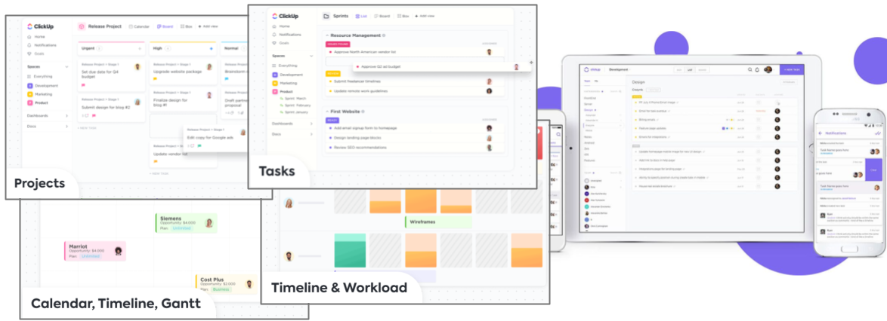

## 1.2 ClickUp으로 할 수 있는 것
- 협업이 필요한 모든 활동들을 Task로 등록하여 다양한 형태의 View로 관리

## 1.3 목적에 맞는 뷰 서비스 
- 기본적으로 List, Board, Box, Calendar, Gantt, Timeline, Table, 최근 Mind Map까지 총 8가지 타입의 뷰 서비스를 제공한다.
- 워크플로우를 시각적으로 파악하는 데 용이하다.
- 업무 관리 리스트를 작성하면 서로의 현황을 쉽게 파악할 수 있어 협업의 효율을 높인다.
- Task를 다양한 조회와 알람 기능으로 업무 누락 발생을 최소화하고 불필요한 커뮤니케이션을 줄일 수 있다.

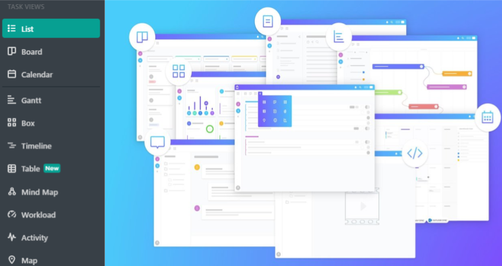

<a href="https://platum.kr/archives/141842" target="_blank">출처)문서 기반 올인원 협업툴, ‘클릭업(Click up)’</a>

## 1.4 실시간 대화와 비동기 커뮤니케이션 지원
❖ 업무 중 방해를 최소화하는 Deep Work를 위한 비동기 커뮤니케이션을 지향
❖컨텍스트 스위칭을 최소화하고 실시간 커뮤니케이션과 비동기 커뮤니케이션을 동시에 할 수 있도록 내부 채팅 서비스를 제공
❖ 비동기 커뮤니케이션을 위해서는 작업 중인 내용 우측에서 코멘트 기능을 이용하고 실시간 커뮤니케이션이 필요할 때는 클릭업 내부에서 채팅서비스를 이용할 수 있다.

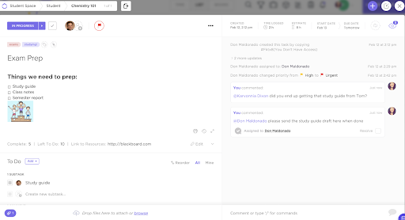

<a href="https://platum.kr/archives/141842" target="_blank">출처)문서 기반 올인원 협업툴, ‘클릭업(Click up)’</a>

## 1.5 1000개 이상의 서비스 연동
- 타임트래킹 앱인 토글(Toggle), 구글 드라이브, 드롭박스, 깃허브, 구글 캘린더, 아웃룩, 슬랙 등 총 1,000개 이상의 외부 서비스가 연동
- Coda처럼 클릭업 내에서 작업한 내역을 실시간으로 외부 서비스와 연동하는 기능은 없지만, 클릭 한 번이면 외부 서비스에 데이터를 보낼 수 있다.

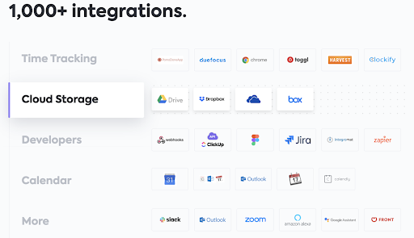

<a href="https://platum.kr/archives/141842" target="_blank">출처)문서 기반 올인원 협업툴, ‘클릭업(Click up)’</a>

## 1.6 장단점 정리 

### 장점
- 다양한 기능
    - 하나의 리스트로 여러개의 View로 볼 수 있음
    - 리스트 안에서 문서작성 마크다운 기능도 훌륭하고, 자유롭게 컬럼들을 추가, 삭제 가능
    - Task를 등록하면 다른 Task와 연결 또는 다른 리스트에 등록할 수 있어 모든 기능을 나열할 수 없을 정도 입니다.
- 외부 다양한 도구들과 연동 
    - Github, Slack, Zapier, 구글드라이브/캘린더 등 1000여개 도구들과 연동이 됩니다.
- 강한 경쟁력
    - 가격정책이 경쟁사에 비해 월 $5로 착합니다.
    - 빠른 업데이트로 점점 완성도가 높아지고 있습니다.

### 단점 
- 아쉬운 안전성과 속도
    - 기능이 많아서 그런지 가끔 랙이 걸립니다.
    - 편집기, Mindmap 등 자잘한 버그가 많습니다.
- 다양한 기능으로 인한 복잡한 사용법
    - 유연함을 추구하여 만들어진 기능들이 조금 어렵습니다.
    - 기능이 많은 것이 복잡해보여 오히려 단점으로 보이는 것이 있습니다.
- 따로 노는 느낌의 기능들
    - Doc 기능이 Task와 연결이 아쉽고
    - Goal 기능이 Task와 별도로 있고, 
    - 하나의 리스트에서 각 View 기능마다 설정을 잡아주어야 합니다.
- 부족한 피드백 시스템
    - 버그를 제보해도 쉽게 개선이 되지 않습니다. 정기적인 업데이트 계획에 따라 개선되어 보입니다. 

<a href="https://kingpinstudio.net/clickup/#ClickUpeun_hwagsilhi_gyeongjaeng-uisig-eun_ganghaeboibnida" target="_blank">출처)ClickUp 후기. 범용성은 가장 뛰어난 생산성 도구</a>

<h2 id="C2"><b>ClickUp 화면 구성</b></h2>

### 2.1 화면 영역 구성 

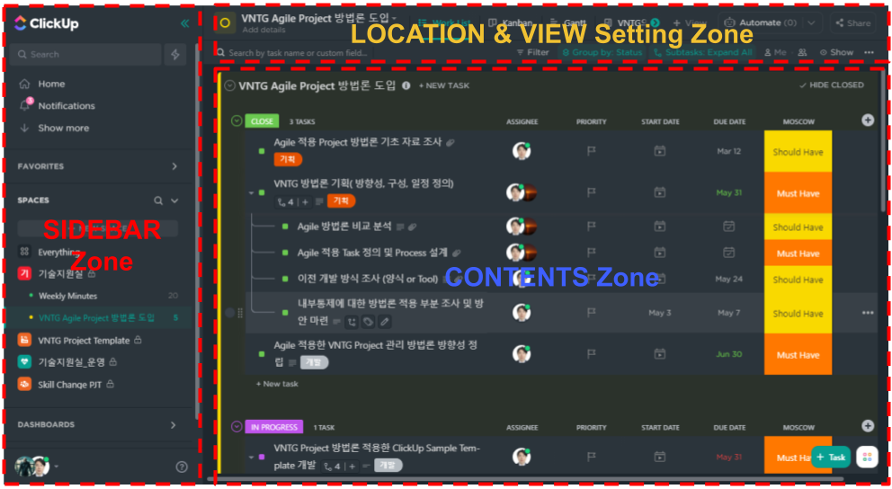

## 2.2 SIDEBAR Zone - Search

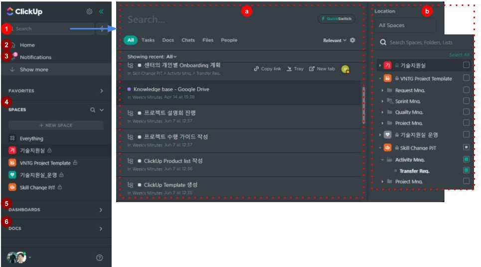

<b>① Search </b>

ⓐ 등록되어지는 모든 컨텐츠(Task, 문서, 채팅, 파일, 사용자) 들을 통합하여 검색할 수 있습니다.
ⓑ Location을 선택하여 검색되어지는 컨텐츠를 제한할 수 있습니다. 

## 2.3 SIDEBAR Zone - Home

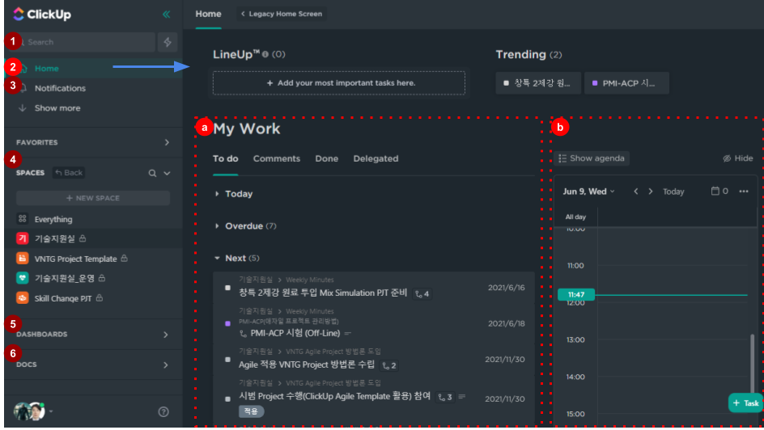

<b>② Home</b>

ⓐ 나의 Task들을 상태에 따라 볼 수 있습니다. Comment도 모아서 볼수 있습니다.
ⓑ 등록된 Task 중 당일 스케줄을 보여줄 수도 있고, 상단의 Show agenda를 클릭하면 스케줄이 아닌 설정된 아젠다 목록을 볼 수 있습니다.   

## 2.4 SIDEBAR Zone - Notifications

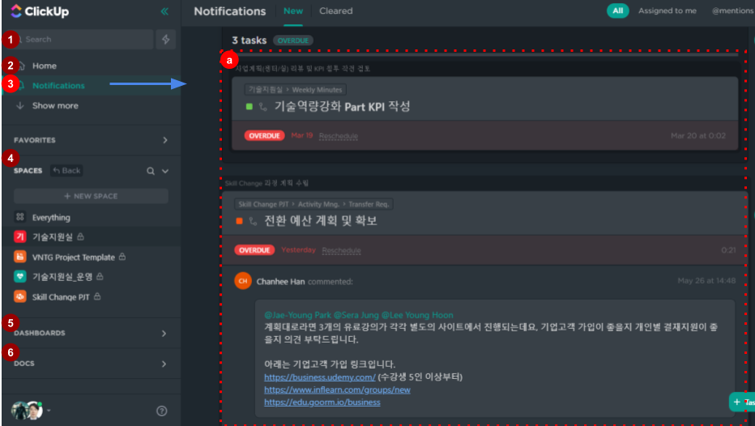

<b>③ Notifications</b>

ⓐ 나의 Task들이 설정된 알람에 따라 내용을 확인할 수 있습니다. 또한, Comment된 내용까지 확인할 수 있습니다.

## 2.5 SIDEBAR Zone - Spaces

<b>④ SPACES</b>

ⓐ SPACES를 누르면 아래에 space들이 나열됩니다. 마찬가지로 하나의 space를 클릭하면 하위 폴더나 List 목록이 보여집니다.
ⓑ 특정 space, 폴더, 또는 list를 클릭하면 그 안의 하위에 등록된 모든 Task들을 상태에 따라 보여줍니다.
 
## 2.6 SIDEBAR Zone - Dashboards

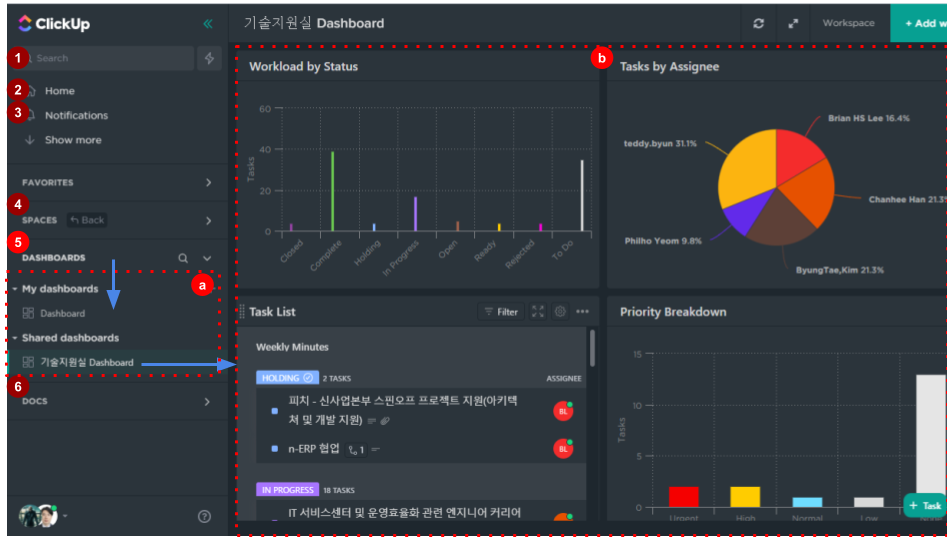

<b>⑤ DASHBOARDS</b>

ⓐ DASHBOARDS를 클릭하면 하위 My dashboards와 Shared dashboards로 분리되어 목록이 보여집니다.
ⓑ목록에 있는 dashboard를 하나 클릭하면 등록된 Task들의 활동 요약들을 Gragh로 보여집니다. 하나의 그래프 도표는 Widget이라 불리고 상단 Add 버튼을 클릭하면 추가 가능합니다.

## 2.7 SIDEBAR Zone - Docs

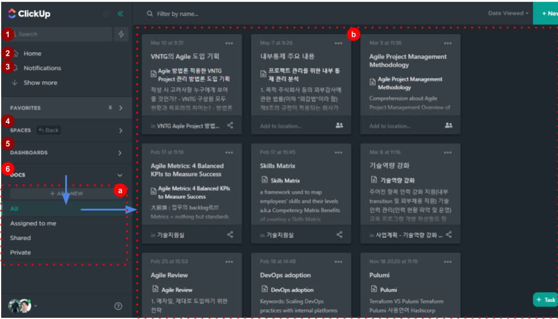

<b>⑥ DOCS</b>

ⓐ DOCS를 클릭하면 하위 All, Assigned to me, Shared, Private로 분리되어 목록이 보여집니다.
ⓑ 하단의 항목 하나를 클릭하면 작성중이거나 작성이 완료된 것 중 내가 볼수 있는 권한이 있는 문서들이 보여집니다.

## 2.8 LOCATION & VIEW Setting Zone - View Type 
❖ <b>List</b>

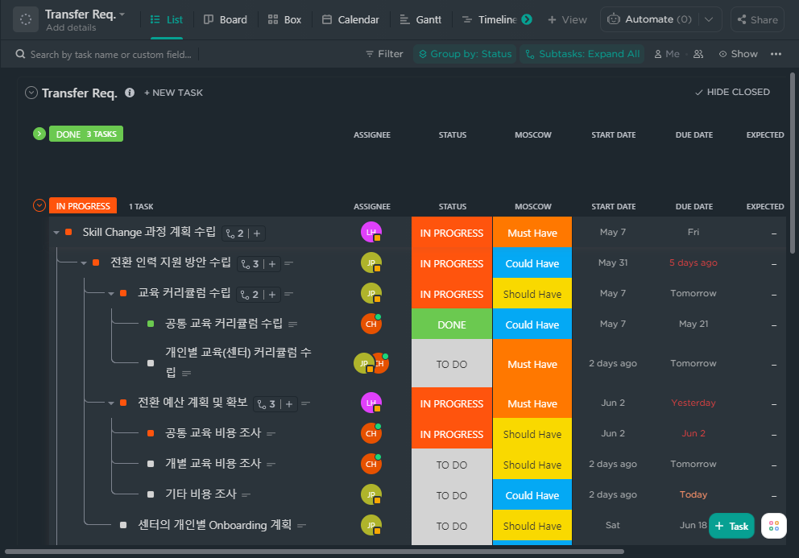

- 같은 내용을 Type에 따라 다르게 볼 수 있습니다. 
- List는 상태에 따라 구분되어 목록으로 볼 수 있습니다.

❖ <b>Kanban Board</b>

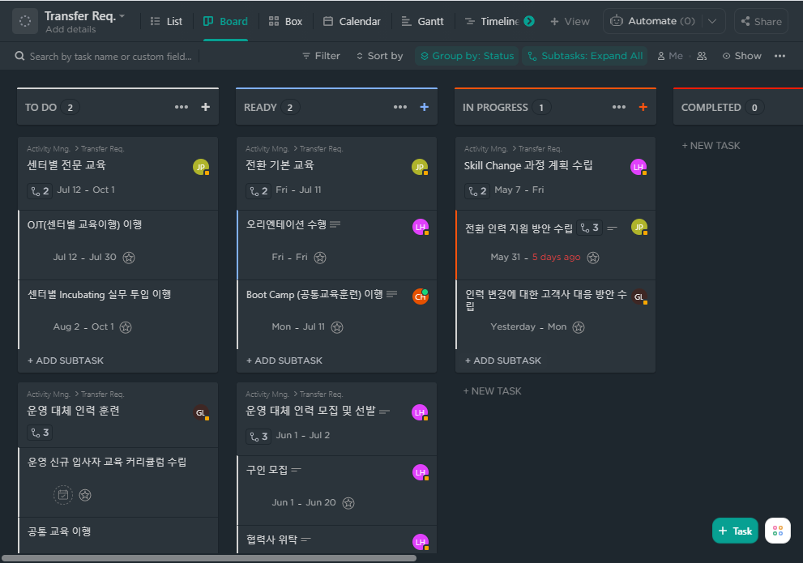

- 각 상태의 경계를 구분지어 Task를 두기 때문에 진행 현황을 쉽게 파악할 수 있습니다.

❖ <b>Box</b>

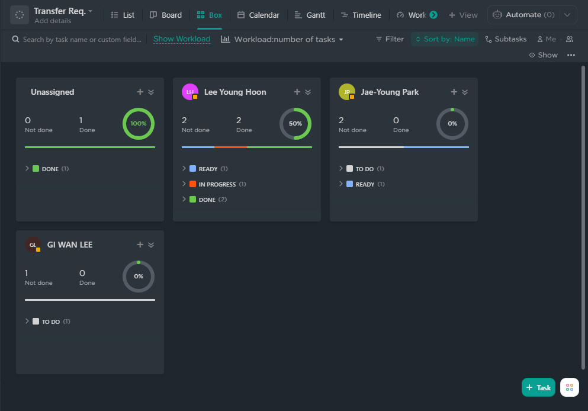

- 각 담당자들에 배정된 Task와 진행상태를 요약하여 보여줍니다.

❖ <b>Calender</b> 

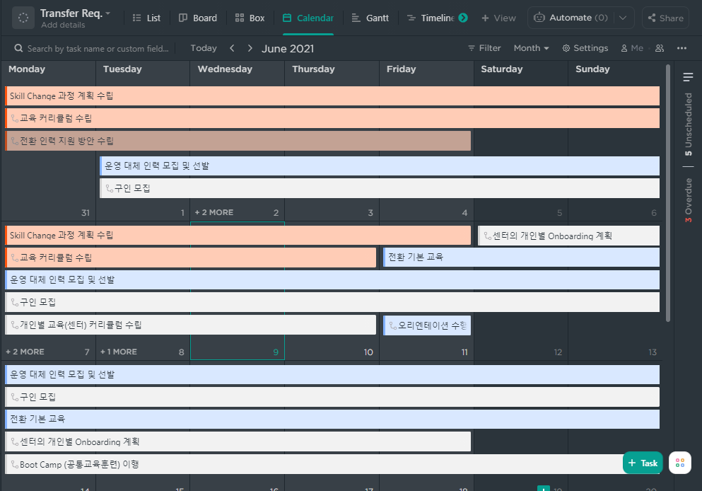

- Task들의 일정들을 달력으로 보여줍니다.

❖ <b>Gantt</b>

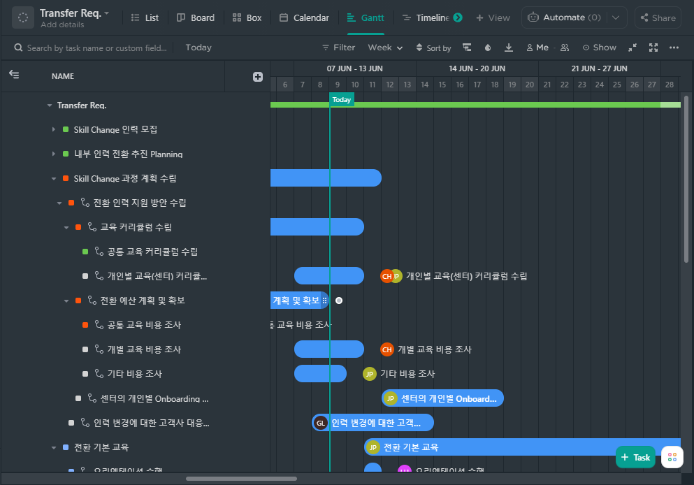

- Gantt 차트로도 볼 수 있습니다. 이 Gantt 차트 내에서 마우스로 드래그&드롭으로 일정을 변경할 수 있습니다. 

❖ <b>Timeline</b>

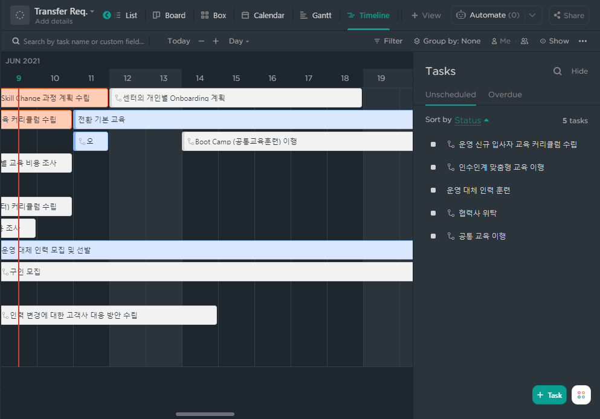

- 날짜 기준으로 Task들을 보여줍니다. 

❖ <b>Workload</b>

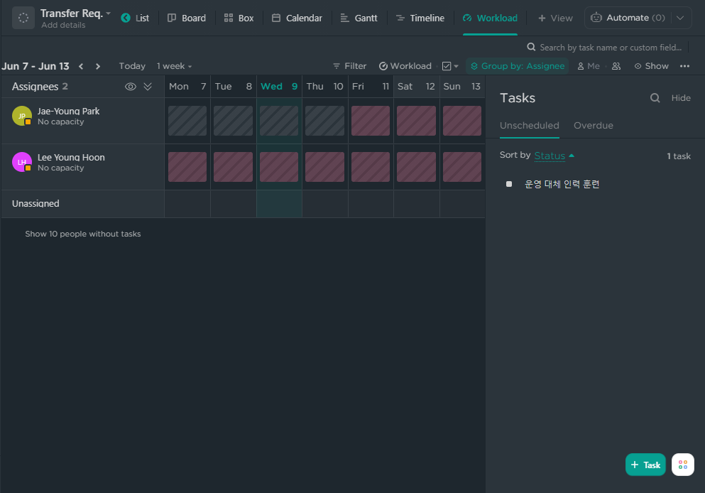

- 담당자 별 진행 Task를 보여줍니다. (Business Upgrade 필요)

❖ <b>Mindmap</b>

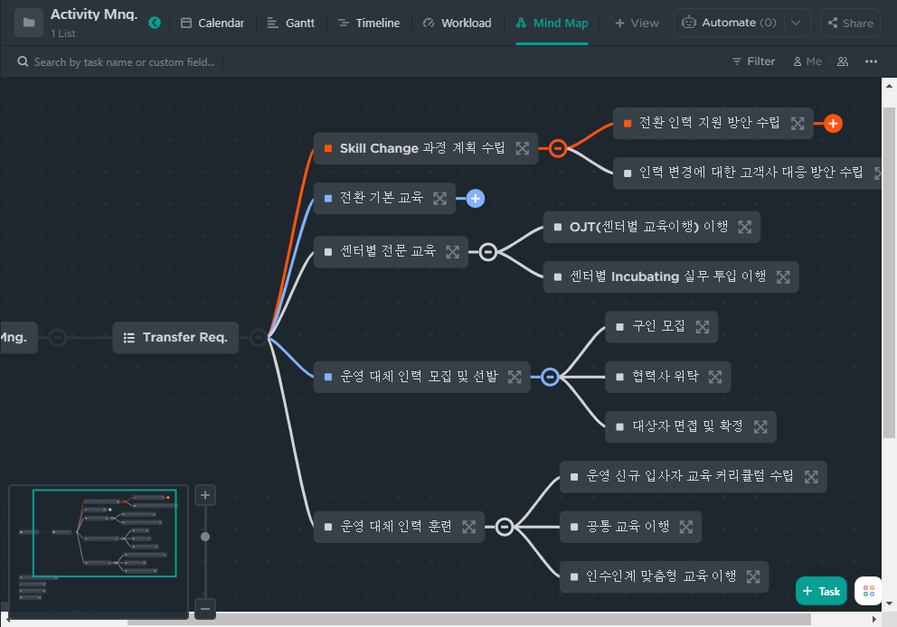

- Task들의 상하 관계를 보여줍니다.

<h2 id="C3"><b>SPACES </b><h2>

## 3.1 NEW SPACE 생성 

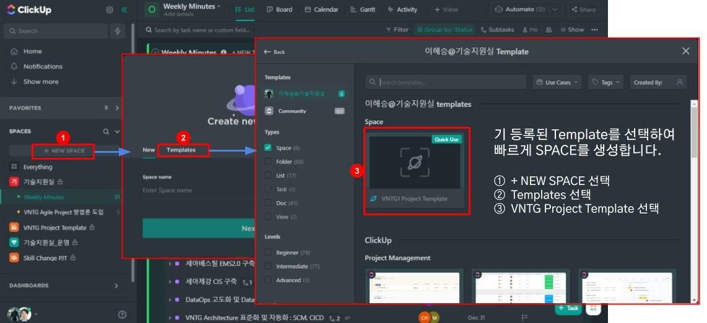

## 3.2 SPACE Setting - Basic 

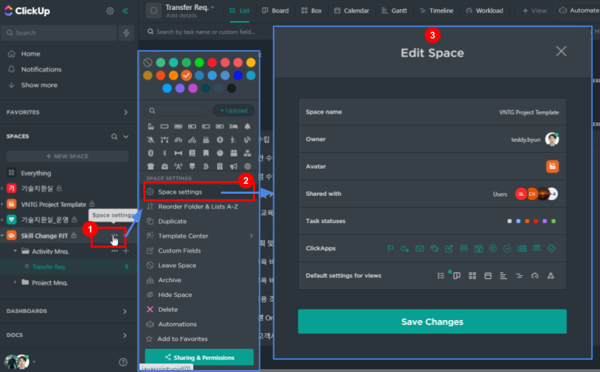

**SPACE 설정을 언제든지 변경할 수 있습니다.**

1. Space 설정 변경을 위한 시작
    - Space명 우측 [ … ] 선택

2. Space setting 선택

3. Edit Space 내 변경 대상 선택
    - space name
    - Owner
    - Avatar
    - Shared with
    - Task statuses
    - ClickApps
    - Default setting for Views

## 3.3 SPACE Setting - Options

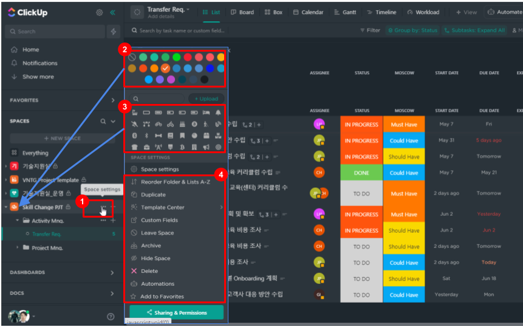

**SPACE Option 설정을 언제든지 변경할 수 있습니다.**

1. Space 설정 변경을 위한 시작
    - Space명 우측 [ … ] 선택
2.  Space 대표 색상 변경
3.  Space 대표 Icon 변경 
4.  Space 기타 옵션  
    - Duplicate : 현 Space 복사 추가 생성
    - Template Center : Space 아래 폴더나 List의 빠른 생성을 위해 기 등록되어 있는 template 선택 
    - Custom Fields : 하위 리스트의 속성들을 생성
    - Leave Space : 선택한 Space에서 나가기 위한 설정
    - Hide Space : Space 목록에서 보이지 않도록 설정
    - Delete : 선택한 Space를 완전 삭제함
    - Automations : Task들의 특정 조건에 자동적으로 알림과  같은 Action을 해주는 것을 설정

<h2 id="C4"><b>Lists </b></h2>

## 4.1 New List 생성 

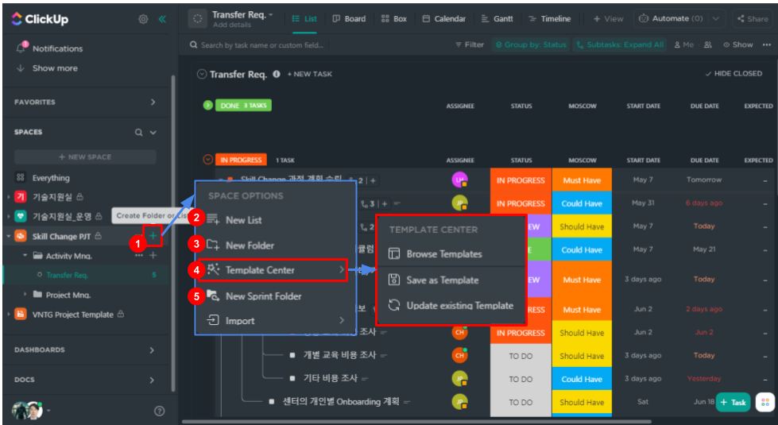

**SPACE Option 설정을 언제든지 변경할 수 있습니다.**

1. Space 내 List 추가를 위한 시작
    - Space명 또는 폴더 우측 [ + ] 선택
2.  New List : Space 아래 생성 
3.  New Folder : Space 아래 폴더 생성
4.  Template Center  
    - Browse Templates : List의 빠른 생성을 위해 이전에 등록되어 있는 List Template 선택 
    - Save as Template : 용도에 맞게 커스터마이징 된Space, List를 Template Pool에 추가 
    - Update existing Template : 템플릿 Pool에 있는 List Template를 현재의 리스트로 Update하여 수정
5.  New Sprint Folder 
    - Sprint에 특화된 List를 생성
    - Sprint list는 반복 횟수와 기간이 자동 설정되어 생성됨 

## 4.2 List Setting - Sprint List setting

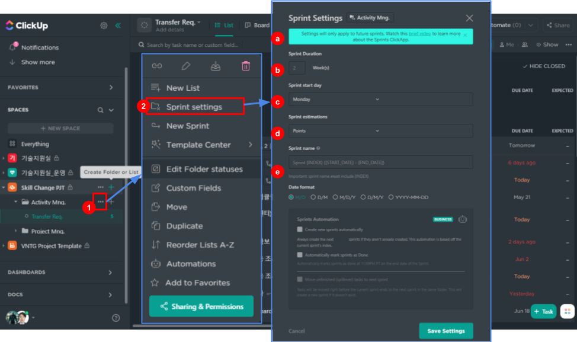

**Lists Option 설정을 언제든지 변경할 수 있습니다.**

1. Space 내 List 설정을  위한 시작
    ⓐ 폴더명 또는 List 우측 [ … ] 선택
2.  Sprint setting : List Type이 Sprint 인 경우의 설정 변경  
    ⓑ Weeks : Sprint 기간 설정 
    ⓒ  Sprint start Day : 출발 요일을 선택 
    ⓓ Sprint estimation : 스프린트에서 구현 가능한 총 Point
    ⓔ Sprint name : [Index]는 반복 차수와 [START_DATE-END_DATA] 는 해당 Sprint의 기간을 자동 표시 

## 4.3 List Setting - List status setting

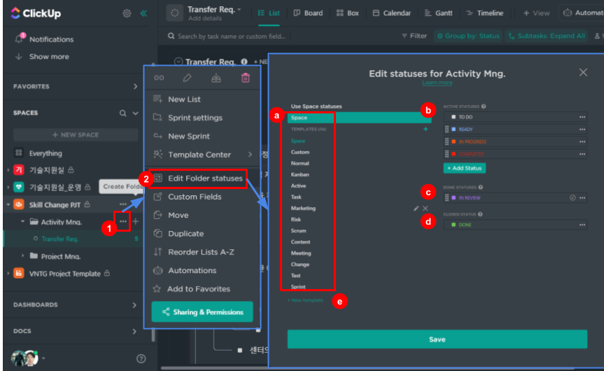

**Sprint, Folder, List의 Task Status 값을 변경할 수 있습니다.**

1. Space 내 List 설정을  위한 시작
    - Space or 폴더명 or List명 우측 [ … ] 선택
2. Edit Folder statuses : Task의 진행 상태를 설정하는 기능으로 칸반 구분으로 사용될 수 있습니다.   
    ⓐ Templates : List 성격에 맞게 미리 정의된 상태 Set으로 선택하면 바로 사용 가능 
    ⓑ Active Status : Task 활동에 대한 시작, 준비, 진행 등의 상태를 정의
    ⓒ Done Status : 작업을 완료한 상태의 표시를 정의함 (ex> Review, Test 등)
    ⓓ Close Status : 최종 끝났을 씨 보여지는 표시를 정의하는 것으로 무조건 존재하는 상태임
    ⓔ New template : Status 상태 Set을 Template로 추가합니다. 

<h2 id="C5"><b>Contents </b></h2>

## 5.1 List Contents - List View 구성 

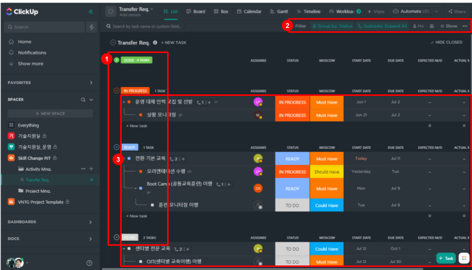

**Contents 영역의 기본 View는 List 입니다.**

1. List의 상태 별로 구분되어 Task 목록을 보여줍니다.
2.  Contents 목록을 보고싶은 형태로 설정을 해줍니다.  
3. 컬럼을 설정한 항목들로 목록에 보여줍니다. 

## 5.2 List Contents - Task 조회 대상 설정

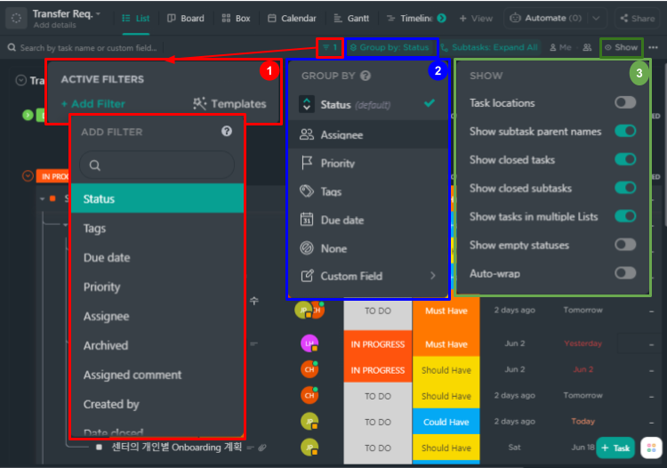

1. <b>Filter</b>
    - List 내 속성들 값을 선택하여 해당되는 Task만  조회 할 수있습니다.
2. <b>Group by</b>
    - 기본은 Status이지만 Assignee, Priority 및 Custom Field까지 그룹핑 할 수 있습니다.
3. <b>Show</b>
    - Task Locations : Task에 위에 속해있는 List 경로를 보여줄 것을 정합니다.
    - Show closed tasks : 종료된 Tasks를 보여줄 것을 정합니다.
    - Show closed subtasks : 종료된 subtasks를 보여줄 것을 정합니다.
    - Show tasks in multiple Lists : 다른 리스트에도 속한 Task를 보여줄지를 정합니다.
    - Show empty statuses : 상태가 지정되어 있지 않아도 보여줄지를 정합니다.
    - Auto-wrap : subtask들을 자동으로 expand 시키지 않고 접을지를 정합니다.

## 5.3 List Contents - Task 등록 및 조회 속성 설정

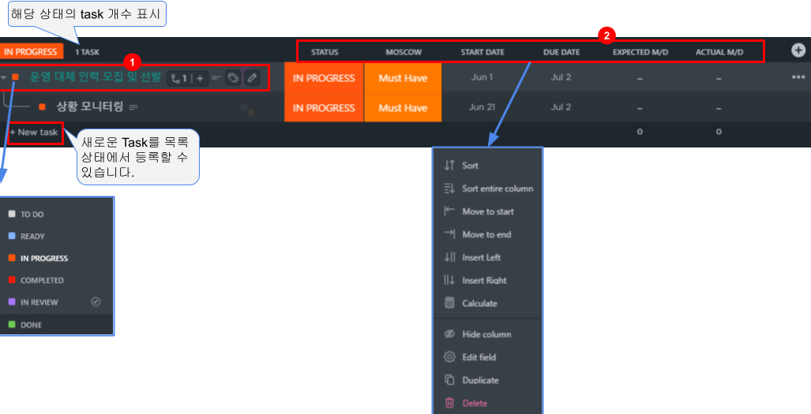

<b>1. Title 영역에도 많은 기능들을 제공합니다.</b>

  : subtask를 열거나 숨깁니다. 

  : List의 상태 별로 구분되어 Task 목록을 보여줍니다. 

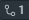  : subTask 개수를 보여주고, 클릭하면 열거나 숨깁니다. 

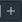  : subTask를 새로 등록할 수 있습니다.  

  : 글 내용이 있음을 알려줍니다. 

  : 글 제목에 Tag를 등록 할 수 있습니다. 

  : 제목을 목록 상태에서 변경할 수 있도록 해줍니다. 

<b>2. Column을 클릭하면 설정을 변경할 수 있습니다.</b>

- **Sort**: Status 별로 선택된 컬럼을 정렬을 합니다.
- **Sort entire column**: 전체 Status를 대상으로 선택된 컬럼을 정렬을 합니다. 
- **Move to start**: Drag&Drop 가능하지만, 컬럼을 한번에 맨 앞으로 보냅니다.
- **Move to end**: 컬럼을 한번에 맨 뒤로 보냅니다.
- **Insert Left**:  좌측에 신규 컬럼을 추가할 수 있습니다.
- **Insert Right**: 우측에 신규 컬럼을 추가할 수 있습니다.
- **Calculate**: 컬럼의 속성이 숫자인 경우 합 계산을 해줍니다.
- **Hide Column**: 전체 Status를 대상으로 선택된 컬럼을 정렬을 합니다. 
- **Edit Field**: 컬럼명을 수정합니다.
- **Duplicate**: 같은 형태의 컬럼을 복사하여 추가 생성할 수 있습니다.
- **Delete**: 선택된 컬럼을 삭제합니다.

## 5.4 List Column 추가 

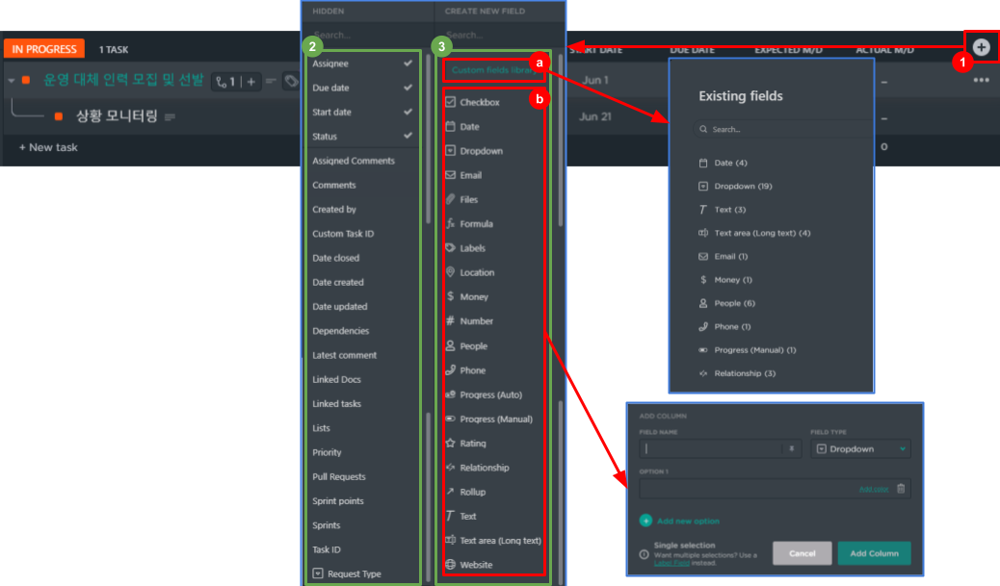

① (+)클릭하여 컬럼을 추가합니다. 

② 팝업된 메뉴의 좌측은 List의 기본 컬럼과 이미 생성된 컬럼 목록을 보여줍니다. 
체크표시는 목록에서 보여주는 컬럼입니다.
체크표시가 없는 컬럼은 존재는 하나 목록에서 보여지지 않는 컬럼입니다. 

③ 팝업된 메뉴의 우측은 생성할 컬럼의 Type을 보여줍니다. 
a. Custom field library : 이전에 등록되어 있는 컬럼을 조회할 수 있고 선택만으로 컬럼을 추가 할수 있습니다.
b. Custom field library에 없는 경우 컬럼 속성에 맞는 Type을 선택하여 추가 합니다. 

