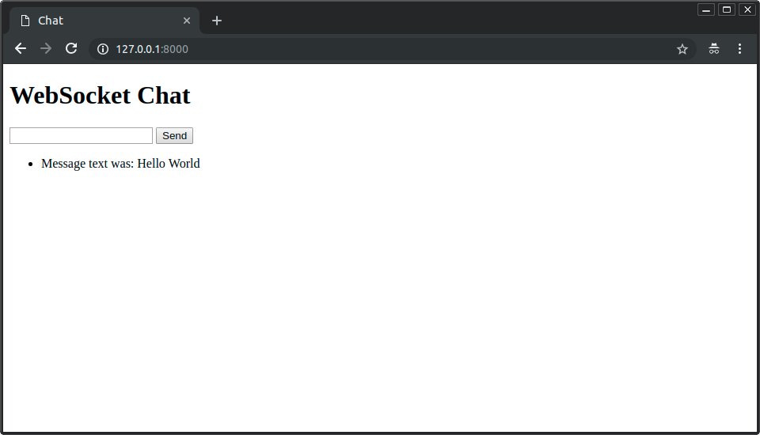

## Intro

최근(이라고 하기에는 좀 시간이 흘렀지만) python framework계에는 다양한 프레임워크들이 속속 시장 진입을 하는 것 같다. 그중에서도 가장 주목을 받는 프레임워크는 아마도 FastAPI 일 것이다. 이름부터가 *빠르다 + API* 이니...이름 만으로도 벌써 반은 먹고 들어가는 기분이다.

FastAPI는 Sebastián Ramírez라는 개발자(혹은 그의 팀?)에 의해 만들어 진 듯 하다. 솔직히 자세히 안 파봤다. 쏴리. 아래 사진은 Medium에 있는 그의 프로필 이미지.
<div align="center">
  <p>
    
  </p>
  <p>
    <b><a href="https://tiangolo.medium.com/" target="_blank"><span style="color:blue">Sebastián Ramírez 프로필</span></a></b>
   </p>   
</div>


구글, 유튜브 등을 검색해도 꽤 많은 자료가 나오니 참조하시기 바란다.(내용도 꽤 충실하고 볼만하다)

일단 특이한 수염(살바도르 달리를 닮았다)의 이 개발자가 만든 FastAPI는 다음과 같은 특징을 갖는다:

- **빠르다**(Starlette과 Pydantic 덕분에) 사용가능한 가장 빠른 파이썬 프레임워크 중 하나라고 자신있게 기재할 정도.
- **빠른 코드 작성**: 약 200~300% 개발 속도 증가라고 했는데 실제로도 꽤 적은 양의 코드로도 개발이 가능한 편.
- **적은 버그**: 개발자에 의한 에러 약 40% 감소...인데 내부 개발팀의 테스트에 근거했다고 함.
- **직관적**: 훌륭한 편집기 지원. 자동완성 지원. 적은 디버깅 시간. 실제로도 VSC(Visual Source Code)나 PyCharm과 함께 잘 동작한다.
- **쉬움**: 문서화가 꽤 잘 되어 있다. 심지어 한글(전체는 아니지만)도 존재!(이것도 한글화 문서를 보고 정리하는 중!)
- **짦음**: 코드 중복 최소화. 각 매개변수 선언의 여러 기능.
- **견고함**: production-ready
- **표준 기반**: 이게 가장 중요한 특징이라고 보여지는데, API 개방형 표준을 지원한다! OpenAPI(former Swagger) 및 JSON schema 지원.

### <a href="https://fastapi.tiangolo.com/ko/#performance" target="_blank"><span style="color:blue">FastAPI official Document</span></a>

FastAPI는 파이썬 3.6+의 API를 빌드하기 위한 modern, fast(performance), standard type hint에 기초한 웹 프레임워크이다. 파이썬 프레임워크 중 최강자라 할 수 있는 django(제발 '장고'라고 읽어줘. 재즈 뮤지션 이름이기도 하니깐)나 미니멀 웹 프레임워크인 flask만 알아주던 파이썬 시장에서 새로운 강자로 발돋움하는 중이기도 하다.

FastAPI는 Starlette, Pydantic을 통합한 프레임워크라고 두 프레임워크의 장점을 갖고 있고, OpenAPI나 JSON을 편하게 다룰 수 있다는 점 만으로도 강점을 갖는다고 봐. 더 많은 장점은 official document를 찬찬히 살펴보면 좋을 듯. 나중에 Pydantic, Starlette, Uvicorn/Hypercorn 등도 좀 더 자세히 다뤄보고 싶은 주제이기도 하다. 

그래서...

## FastAPI를 느껴 보자!

정말 간단한 예제를 통해서 FastAPI를 알아보도록 하자.

```python
from fastapi import FastAPI

app = FastAPI()

@app.get("/")
async def root():
	return {"message": "Hello World"}
```

main.py를 만들고 위 내용을 복사한다.

Virtual Environment(venv)에서 먼저

```python
pip install fastapi
pip install uvicorn (or hypercorn)
```

으로 설치를 해두고 라이브 서버를 실행한다.

(uvicorn 말고 hypercorn을 써도 되는데, 둘다 ASGi를 지원하는 좋은 서버들이다. 차이가 있다면 hypercorn은  HTTP/1, HTTP2, WebSocket over H/1 and H/2, ASGI/2, ASGI/3를 모두 지원해서 개인적으로 좀 더 선호하고 있다)

```python
uvicorn main:app --reload
```

실행하면 터미널에 

```python
INFO:  Uvicorn running on http://127.0.0.1:8000 (Press CTRL+C to quit)
```

이런 메시지가 보이는데 이 라인은 로컬에서 앱이 서비스되는 URL을 보여준다. 이 URL을 마우스로 클릭하거나 브라우저로 복사해서 오픈하면 아래와 같은 JSON 응답을 확인할 수 있다:

```python
{"message": "Hello World"}
```

여기까지만 보면 뭐가 크게 다른지 안 보인다. 그래서 준비했다!

```python
http://127.0.0.1:8000/docs
```

<center></center>
그리고 또

```python
http://127.0.0.1:8000/redoc
```

<center></center>

크으..그렇다. 이 두가지 API  UI 때문에라도 이걸 써봐야 한다.

그렇지만 이걸로만 끝내면 아까 FastAPI의 장점에서 이야기한 OpenAPI가 슬퍼한다.

```python
http://127.0.0.1:8000/openapi.json
```

```json
{

	"openapi": "3.0.2",
	"info": {
		"title": "FastAPI",
		"version": "0.1.0"

	},

	"paths": {
		"/items/": {
			"get": {
				"responses": {
					"200": {
						"description": "Successful Response",
						"content": {
								"application/json": {

...
```

여기까지와 실제 API간의 인터랙션을 위한 기본 학습 내용은 아래 URL을 참조하길 바란다. 문서가 매우 잘 되어 있어서 자습하기에도 좋다. 음 설마 API를 하려고 하니 GET, PUT, DELETE, UPDATE는 ... 당연히 알거라 생각해서 패스한다. 

<center></center>

### <a href="https://fastapi.tiangolo.com/ko/tutorial/first-steps/" target="_blank"><span style="color:blue">첫걸음 - FastAPI</span></a>


실제 제목이었던 내용인 FastAPI, WebSocket, 그리고 Docker에 대한 내용을 이제 알아보....도록 합니다.

## **다시 FastAPI, WebSocket, Docker**

순서를 정해서 차례대로 달려 보자. 여기에 있는 예제는 솔직하게, FastAPI Official Document만 잘 찾아봐도 다 할 수 있는 내용이다:

1. FastAPI에 WebSocket Client를 추가해 보자.
2. Dockerize를 해보면 끝.

사실 FastAPI, Docker, WebSocket 각각만 해도 엄청난 양의 블로그, 문서를 만들 수 있을 만큼의 내용이지만 날림의 대가로서 일단 이것만 하고 여유가 되면(=누군가 조공을 바치면?) 각각에 대해서도 썰을 풀어볼까 한다.

### 1. FastAPI에 WebSocket Client를 추가해 보자.

애용하는 IDE에서 project/folder를 만들고 venv를 구성하고, 위에 설명이 있는 것처럼 fastapi, uvicorn을 설치한다. 그리고 보편적으로 사용할 main.py를 만든다. (개인적으로 Golang 은  VSC에서, Python은 PyCharm, 그리고 linux/Mac OS 터미널에서는 nano 에디터를 쓴다. 개인취향이다 ㅠㅠ)

<center></center>

이 main.py를 채우기 위해서 우선 공식문서에서 websocket을 찾아보자.

<center></center>

주욱 읽어가다 보면 WebSocket client에 대한 내용을 볼 수 있다. [WebSockets - FastAPI](https://fastapi.tiangolo.com/ko/advanced/websockets/?h=websoc)

Await for messages and send messages 에 있는 샘플 소스코드를 복사한 후, 에디터의 main.py에 붙여넣기한다. [WebSockets - FastAPI](https://fastapi.tiangolo.com/ko/advanced/websockets/?h=websoc#await-for-messages-and-send-messages)


<center></center>

그럼 자신있게 라이브 서버를 실행시켜 보자.

```bash
unicorn main:app --reload
```

그리고 브라우저를 열고 [http://127.0.0.1:8000](http://127.0.0.1:8000) 을 보면 아래와 같은 페이지를 보게 될 것이다:

<center></center>

오, 됐어! 이렇게 쉬울 수가! 하면서 텍스트 입력 창에 여러가지 써보고 Send를 눌러보면....

음...아무런 동작을 하지 않는다..

<center></center>

에디터 터미널 등을 살펴보면 다음과 같은 에러 메시지를 찾아볼 수 있을 것이다:

<center></center>

메시지를 보면,

```bash
WARNING:  Unsupported upgrade request.
WARNING:  No supported WebSocket library detected. Please use 'pip install uvicorn[standard]', or install 'websockets' or 'wsproto' manually.
```

아하! WebSocket 라이브러리가 설치 안되었구나. 바로 'pip install websockets'로 설치해 주시고 나서 라이브서버 재실행, 그리고 나서 브라우저를 리로드해주고, 텍스트 입력창에 글을 쓰고 send를 누르면,

<center></center>

<center></center>

WebSocket이 이렇게 쉬운건가 하는 가벼운 착각(?)을 하면서 아래 내용을 좀 더 읽어 보시길 권함. 

사실 async/await 등 개념부터 제대로 이해하는 것이 맞지만 우선 되는 걸 확인하면서 하나씩 짚어 보는 방법도 나쁘지 않다고 보기에, 예제를 열심히 따라하거나 내용을 상세히 읽어 보시길 권합니다~

### 2. Dockerize를 해보면 끝!

일단 Docker, Container 라고 이야기하면 경기를 일으키는 분들도 꽤 있다(정말이다. 내 주변에도 꽤 있다.) 개인적인 경험으로는 Docker나 container, Kubernetes(k8s) 등과 VM, instance 등이 다양한 개념이 클라우드와 함께 일반인들에게 혼란을 주기도 하는 것 같다. 그런데, 결국 내 밥벌이용이 아니면 같은 철자로 된 단어를 들어도 뜻을 모르는게 당연한거 아닌가 싶다. CD가 누구에게는 Continuous Delivery지만, 누구에게는 Compact Disc, 혹은 Certificate of Deposit 혹은 ....알쥬? 그런 셈이다. 

각설하고, 일단 에디터로 돌아가서 Dockerfile을 작성해 보자. 아, 그전에 양해를 구할 것이 있다. 

실제 워킹 폴더 명이 회사에서 진행 예정인 중요 프로젝트 명으로 되어 있어서 실제 이름을 적다가 식껍해서 우선 상황으로 설명하는 것으로 변경하였다. 즉, 실제 워킹하지 않는 폴더 명을 Dockerfile, Docker-compose.yml 등에 적었다는 의미이다. 사실 참조의 의미로만 보시는 편이 좋을 듯 하다.

총 3개의 파일이 추가된다: 

- **<span style="color:red">dockerfile</span>**

<center></center>

```docker
FROM    python:3.7-rc-alpine 

WORKDIR /usr/local/blahblah/
ADD requirements.txt

RUN pip install --trusted-hosts pypi.python.org -r requirements.txt

CMD ["uvicorn", "main:app", "--reload", "--host", "0.0.0.0", "--port", "8000"]
```

FROM은 python 3.7-rc-alpine 버전부터 사용할 수 있다는 것인데, FastAPI는 3.6+ 지원한다. 참고하셈.

WORKDIR은 위에 설명해 놨듯, 임의의 폴더를 그냥 쓴거다. 다음에 또 블로그 예제 올리게 되면 그땐 아예 환경 분리해서 따로 만들어서 드리리다 ㅠㅠ 죄송함돠!!!

ADD에는 requirements.txt를 로드해서 필요한 라이브러리 등을 적어 놓는다.

- **<span style="color:red">requirements.txt</span>**

<center></center>

 

```bash
fastapi
uvicorn
websockets
```

처음 빌드할때 websockets을 깜빡해서 왜 에러가 뜨지 왜 안되지 하면서 고민을 잠깐 했었다. 이래서 머리가 나쁘면 손발이 고생한다는 것 같다. 

- **<span style="color:red">docker-compose.yml</span>**

<center></center>


```yaml
version: "3.7"
services:
  api:
    container_name: "docker-fastapi-websocket"
    build: .
    ports:
      - 8080:8000
    volumes:
    - ./app:/usr/local.////////
```

## 급결론

(너무 자세한 설명을 생략했지만서도) 공부하시면 쉽게 접근할 수 있는 내용이라고 믿으면서, docker-compose를 실행하기로 한다.

```python
docker-compose up --build
```

실행하고 나면 다음과 같이 브라우저에서 동작하는 것을 볼 수 있을 것이다:

<center></center>

스타트업이나 새로운 프러덕트, 서비스를 개발하고자 하는 곳에서는 파이썬을 많이 사용하고 있다. 실제로도 Machine Learning(ML) 프로젝트나 개발을 하는 곳에서는 자바, C# 등 보다는 파이썬과 관련된 다양한 라이브러리(개인적으로는 PyTorch + PyDantic을 공부 중이다), 프레임워크를 적용하는 경우가 많이 늘은 것 같다. 

파이썬의 장점은 쉬운 것이고 단점은 어렵다는 것이다. 파이썬은 루틴, 객체지향, 함수형 언어의 특징이 골고루 들어 있고 다양한 프레임워크와 라이브러리가 산재한다는 것 때문에 쉽게 시작하지만 점점 어려워지는 언어인 것 같다. 

파이썬을 사용하면 가장 많이 만나게 되는 프레임워크는 django, flask가 있고 전직장 등에서 django의 장단점을 많이 경험해 보았기에 FastAPI라는 프레임워크가 주는 기대감이 매우 크다. 일단 빠르고, API 기반이란 점이 아주 마음에 든다. 특히 향후 전사 시스템 아키텍쳐를 API, GraphQL, WebSocket or gRPC 등으로 범벅하려는 사악한 계획을 세우고 있기 때문에 더더욱 그렇다.

다음에 기회가 되면 golang으로 테스트하는 내용에 대해서도 정리해 보고 싶기도 하고 FastAPI의 기반이 된 Starlette, Pydantic, 혹은 ASGi에 대한 것도 정리해 보고 싶지만...원체 게을러서 언제 할지는 모르겠다. 

일단 줄입니다~ 끄읕!