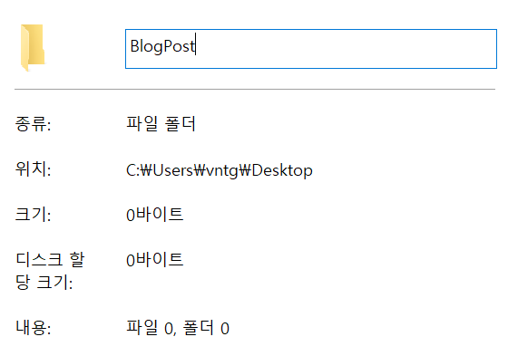
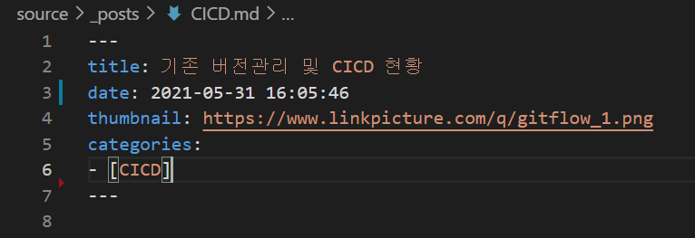

안녕하세요. 이번 포스트는 블로그 포스트 추가 방법을 알려드리려고 합니다. 저희는 Git을 통해 소스 코드를 저장하고 편집하는 방법을 사용할것입니다.  Git으로 소스 코드를 관리하고 개발 및 편집을 하려면 먼저 저장소를 초기화하거나 원격 저장소를 클론(Clone)해와야 합니다. 클론(Clone)을 사용하면 원격 저장소의 코드를 내 컴퓨터에 받아올 수 있고 로컬 저장소(.git)도 자동으로 생기게 됩니다.  이번글에서는 git clone 명령어의 사용법에 대해서 자세히 소개하고 포스트 추가방법까지 상세히 설명드리겠습니다.


진행하기전 몇가지 설치 및 다운로드를 해야합니다. 아래와 같습니다:

##### 1. Node.js <a href="https://nodejs.org/ko/download/" target="_blank"><span style="color:blue">다운로드 </span></a>
##### 2. Git  <a href="https://git-scm.com/" target="_blank"><span style="color:blue">다운로드 </span></a>
##### 3. Text Editor (e.g. Visual Studio Code, Atom) 다운로드
##### 4. Hexo 다운로드 (명령 프롬프트 이용)
```
npm install -g hexo-cli
```

* * *

이제 포스트 추가 방법을 알려드리겠습니다. 크게 어려운것은 없으니 천천히 따라와주세요. 

### 1. 빈 폴더를 생성해주세요. 이 폴더에 소소코드를 저장할것입니다. 폴더 경로를 잘 기억해주세요. 

<center></center>

### 2. 명령 프롬프트에서 생성한 폴더 directory로 이동후 클론(Clone)명령어를 활용해 Github의 vntg-blog저장소를 받아주세요. 

```
cd BlogPost
git clone https://github.com/VntgCorp/vntg-blog.git
```

### 3. vntg-blog directory의 themes directory 들어가서 vntgblogtheme 테마를 클론해줍니다. 

```
cd vntg-blog 
cd themes
git clone https://github.com/VntgCorp/vntgblogtheme.git
```

* 현재 directory는 이와 같습니다. 
BlogPost -> vntg-blog -> themes 

### 4. 새로 생성된 폴더를 Visual Studio Code나 다른 text editor로 오픈한후 root 폴더에 있는 _config.yml theme를 vntgblogtheme으로 바꿔줍니다.

```
# Extensions
theme: vntgblogtheme
```

### 5. source\_posts으로 가서 우클릭후 NewFile을 생성합니다. 파일이름을 적고 .md로 맞춰줍니다. (md는 Markdown 파일이라는것을 알립니다.)


### 6. 포스트 내용 삽입전 포스트 제목, 썸네일, 작성일지, 썸네일 그리고 카테고리(필요시)를 적어줍니다. 

<center></center>

### 7. 포스트 내용 삽입을 해줍니다. 마크다운으로 쉽게 콘텐츠 삽입이 가능합니다. <a href="https://www.markdownguide.org/basic-syntax/" target="_blank"><span style="color:blue">마크다운 다큐멘테이션</span></a> 을 통해 이미지는 물론 BlockQuote나 폰트 사이즈도 쉽게 바꿀수 있습니다.

- 포스트 내용 삽입 중 블로그 확인을 하고 싶다면 명령프롬프트에서 hexo server를 입력하시면 localhost 링크가 있습니다. 그 링크를 타고 들어오시면 신규 포스트 추가 내용을 로컬PC에서 확인이 가능합니다.

### 8. 깃허브 페이지에 배포하기.

배포하기전 _config.yml파일에 들어가서 배포할 저장소가 맞는지 확인합니다. 저희 공식 기술블로그 repo는 아래와 같습니다. 
```
deploy:
  type: git
  repo: https://github.com/VntgCorp/VntgCorp.github.io.git
  branch: master
  ```

이제 정적 리소스를 생성해야합니다. 아래 명령어를 실행하면 public 폴더가 생성되면서 정적 리소스가 생성됩니다. 이 파일들이 실제로 깃허브 페이지에 배포될 파일들입니다. 
```
hexo generate
```
아래 명령어를 사용하면 생성한 정적 리소스가 배포됩니다. VntgCorp.github.io 주소로 들어가면 정상적으로 배포된 것을 확인할 수 있습니다.
```
hexo deploy
```
정적 리소스를 삭제하는 명령어는 아래와 같습니다. 간혹 정상적으로 배포가 되었는데도 불구하고 페이지가 업데이트 되지 않는 현상이 생기면 리소스를 삭제하고 다시 생성하시면 됩니다. 그래도 안되면 캐시 비우기와 강력 새로고침을 합니다.
```
hexo clean
```

### 9. 깃허브 저장소에 소스 저장하기

위의 배포 과정은 보여지는 페이지를 저장한 것이고, 이제 실제 소스와 이미지들을 깃허브 저장소에 저장해야합니다. 그래야 다른분이 포스트 추가가 가능할테니까요. 아래 코드를 입력하시면 소스들이 처음에 클론 받았던 저장소로 푸쉬된 것을 확인할수 있습니다. 

```
git init
git remote add origin https://github.com/VntgCorp/vntg-blog.git
git add .
git commit -m '커밋 메시지' 
git push origin master
```

간혹 깃의 히스토리가 충돌되어 푸쉬가 안되는 경우가 있는데 이런 상황에는 아래 명령어를 사용하여 해결해 주시면 됩니다.
```
git pull origin master --allow-unrelated-histories
```
직접 테마를 수정하지 않는 이상 테마 저장소는 건드리지 않습니다. 

* * *

### 주의사항: 
저희 기술블로그는 <b>Hexo</b>를 기반으로 만든 페이지입니다. 

저희 Hexo 블로그는 3개의 저장소(repo)를 사용합니다. 한개는 <a href="https://github.com/VntgCorp/VntgCorp.github.io" target="_blank"><span style="color:blue">배포 페이지</span></a>를 저장하는 저장소로 사용되며 다른 한개는 실제 소스를 저장하는 저장소로 사용됩니다. 마지막으로 테마 페이지는 저희 기술블로그 테마를 클론할때만 사용합니다.

클론/푸쉬/커밋등을 하는 중에 다른 저장소를 건드리면 복구가 힘들어지고 골치가 아플 수 있습니다. (저처럼.. ㅠㅠ)
항상 주의깊게 어떤 저장소를 건드리는지 확인하시면 좋겠습니다.